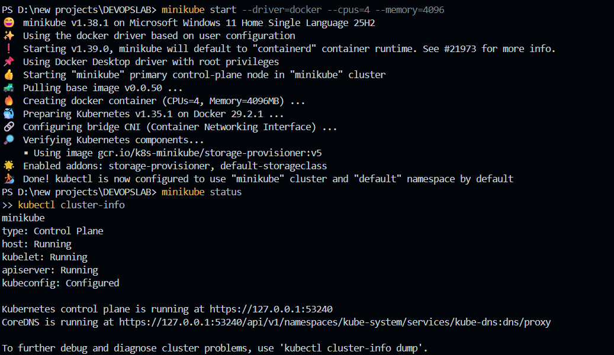
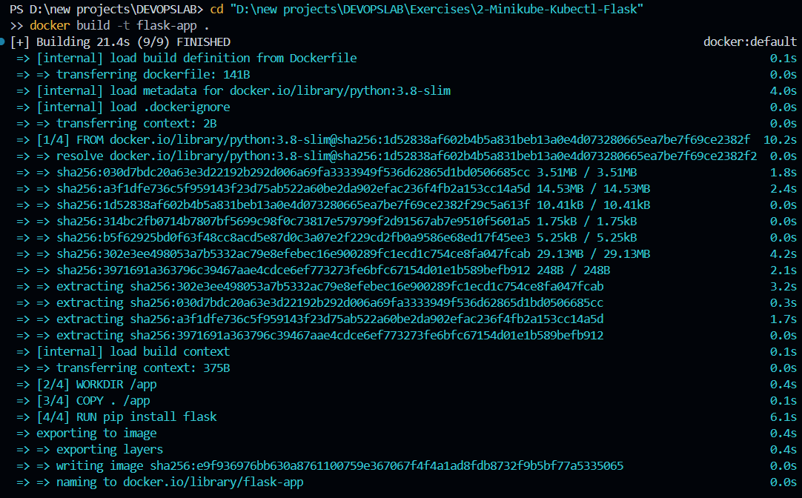
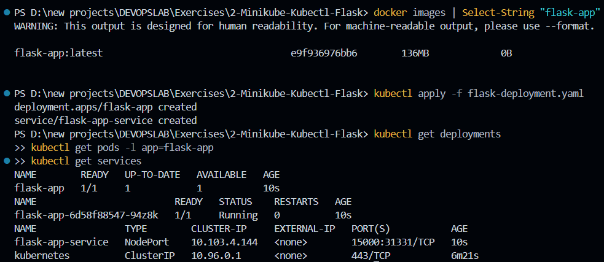
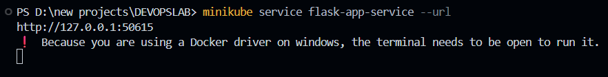
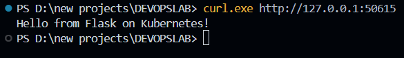

# Exercise 2 – Deploy a Flask App on Minikube using kubectl and YAML

## Objective

Deploy a custom Python Flask application as a Docker container on a local Kubernetes cluster (Minikube), using a Kubernetes Deployment to manage the Pod and a NodePort Service to expose it, then access the application through the browser/terminal via `minikube service`.

## Environment

* OS: Windows 11
* Kubernetes: v1.35.1
* Minikube: v1.38.1 (Driver: Docker)
* Container Runtime: Docker Desktop (WSL2 backend)
* Application: Custom Flask app (Python 3.8, `flask` package)

## 1. Start Minikube

Start the local Kubernetes cluster with explicit resource allocation:

```powershell
minikube start --driver=docker --cpus=4 --memory=4096
minikube status
kubectl cluster-info
```

Minikube pulled the base control-plane images, created the cluster with 4 CPUs and 4096 MB of RAM, and initialized Kubernetes v1.35.1 with the CNI configured. The status check confirmed the control plane, kubelet, and apiserver were all running, and `kubectl cluster-info` showed the cluster reachable at its local HTTPS endpoint (e.g. `https://127.0.0.1:53240`).



## 2. Create the Flask Application

**File:** `app.py`

```python
from flask import Flask
app = Flask(__name__)

@app.route('/')
def home():
    return "Hello from Flask on Kubernetes!"

if __name__ == '__main__':
    app.run(host='0.0.0.0', port=15000)
```

The app defines a single route (`/`) that returns a plain text greeting, and runs on port `15000`, bound to all interfaces (`0.0.0.0`) so it's reachable from outside the container.

## 3. Create the Dockerfile

**File:** `Dockerfile`

```dockerfile
FROM python:3.8-slim
WORKDIR /app
COPY . /app
RUN pip install flask
CMD ["python", "app.py"]
```

Uses a slim Python 3.8 base image, copies the app source into `/app`, installs Flask, and runs the app as the container's entrypoint.

## 4. Point Docker CLI at Minikube's Docker Daemon

Since Minikube runs its own internal Docker daemon, the image needs to be built there directly so the cluster can find it without pulling from a registry:

```powershell
& minikube docker-env | Invoke-Expression
```

*(PowerShell equivalent of `eval $(minikube docker-env)` on Linux/macOS — this must be re-run in any new terminal session before building images.)*

## 5. Build the Docker Image

```powershell
docker build -t flask-app .
```

Docker executed the build steps in order — loading the Dockerfile, copying the application files, and installing Flask on top of the `python:3.8-slim` base image. The build completed successfully, producing the image `flask-app:latest` at roughly 136 MB.



## 6. Create the Kubernetes Deployment and Service YAML

**File:** `flask-deployment.yaml`

```yaml
apiVersion: apps/v1
kind: Deployment
metadata:
  name: flask-app
spec:
  replicas: 1
  selector:
    matchLabels:
      app: flask-app
  template:
    metadata:
      labels:
        app: flask-app
    spec:
      containers:
      - name: flask-app
        image: flask-app:latest
        imagePullPolicy: Never
        ports:
        - containerPort: 15000
---
apiVersion: v1
kind: Service
metadata:
  name: flask-app-service
spec:
  selector:
    app: flask-app
  ports:
  - port: 15000
    targetPort: 15000
  type: NodePort
```

**Key design choices:**

* `imagePullPolicy: Never` — forces Kubernetes to use the locally built `flask-app:latest` image instead of trying to pull it from an external registry like Docker Hub.
* `containerPort: 15000` — matches the port the Flask app listens on inside the container.
* The Service maps external `port: 15000` to the container's `targetPort: 15000`, creating the chain: **External Request → Service → Container**.
* `type: NodePort` — exposes the Service outside the cluster (as opposed to the default `ClusterIP`, which is only reachable from inside the cluster).

## 7. Verify the Image and Deploy

```powershell
docker images | Select-String "flask-app"

kubectl apply -f flask-deployment.yaml

kubectl get deployments
kubectl get pods -l app=flask-app
kubectl get services
```

**Results:**

* Docker confirmed the `flask-app:latest` image was present locally (~136 MB).
* `kubectl apply` created both the Deployment and the Service in a single command, since they were defined in the same YAML file separated by `---`.
* **Deployment:** `flask-app` → `1/1` available.
* **Pod:** `flask-app-6d58f88547-94z8k` → `Running`.
* **Service:** `flask-app-service` → type `NodePort`, mapping `15000:31331/TCP`.



## 8. Access the Application

Because the Docker driver on Windows doesn't route NodePort traffic directly to `localhost`, `minikube service` was used to create a temporary tunnel:

```powershell
minikube service flask-app-service --url
```

Output:

```text
http://127.0.0.1:50615
! Because you are using a Docker driver on windows, the terminal needs to be open to run it.
```

This command must be left running in its own terminal — the tunnel stays alive only as long as the process is active.



In a **separate** terminal, the app was reached using the tunneled URL:

```powershell
curl.exe http://127.0.0.1:50615
```

Output:

```text
Hello from Flask on Kubernetes!
```

The Flask application responded successfully, confirming the full request path worked end-to-end: **host → Minikube tunnel → NodePort Service → Pod → Flask container**.



## 9. Kubernetes Working (Request Flow)

```text
kubectl apply -f flask-deployment.yaml
   ↓
Kubernetes API Server
   ↓
etcd (stores Deployment + Service desired state)
   ↓
Scheduler (assigns Pod to a Node)
   ↓
Worker Node
   ↓
Kubelet (ensures container is running per spec)
   ↓
Container Runtime (Docker, pulls local flask-app:latest image)
   ↓
Flask Container (listens on port 15000)
   ↓
NodePort Service (routes external traffic to the Pod)
   ↓
minikube service --url (tunnels host traffic to the NodePort)
```

* `kubectl apply` submits the Deployment and Service manifests to the API Server.
* The desired state (1 replica, image, ports) is persisted in `etcd`.
* The Scheduler places the Pod on the (single) Minikube node.
* The Kubelet on that node instructs the container runtime to start the container from the local `flask-app:latest` image (`imagePullPolicy: Never` skips any registry pull).
* The Flask app starts inside the container and listens on port `15000`.
* The NodePort Service maps that container port to a randomly assigned high port on the node.
* `minikube service --url` creates a tunnel from the host machine to that NodePort, making the app reachable via `curl` or a browser.

## 10. Commands Used

```powershell
minikube start --driver=docker --cpus=4 --memory=4096
minikube status
kubectl cluster-info

& minikube docker-env | Invoke-Expression
docker build -t flask-app .

kubectl apply -f flask-deployment.yaml
kubectl get deployments
kubectl get pods -l app=flask-app
kubectl get services

minikube service flask-app-service --url
curl.exe http://127.0.0.1:50615
```

## 11. Troubleshooting Notes

* **`eval` not recognized in PowerShell:** `eval $(minikube docker-env)` is bash-only syntax. The PowerShell equivalent is `& minikube docker-env | Invoke-Expression`.
* **`curl` behaves differently in PowerShell:** the built-in `curl` alias points to `Invoke-WebRequest`, which doesn't print the raw response body the same way. Using `curl.exe` explicitly calls the real curl binary for output matching Linux/macOS behavior.
* **Apiserver failing to start (`K8S_APISERVER_MISSING`):** encountered on an earlier `minikube start` attempt. Resolved by running `minikube delete` to clear the broken cluster state, confirming Docker Desktop was healthy (`docker info`), and restarting with the driver explicitly set: `minikube start --driver=docker --cpus=4 --memory=4096`.
* **NodePort not reachable directly on `localhost`:** on Windows/macOS with the Docker driver, NodePort services aren't exposed straight to the host network the way they are on Linux. `minikube service <name> --url` must be used to create a tunnel, and that terminal must stay open for the duration of access.
* **Working directory matters only for build/apply steps:** `docker build` and `kubectl apply -f` require being in the folder containing the `Dockerfile` / YAML (or passing a full path). Commands like `minikube service` and `curl` are independent of the current working directory.

## 12. Result

The custom Flask application was successfully containerized, deployed to a local Minikube cluster via a Kubernetes Deployment, and exposed using a NodePort Service. The Pod reached the `Running` state, and the application was successfully accessed through a `minikube service` tunnel, returning the expected response: **"Hello from Flask on Kubernetes!"**