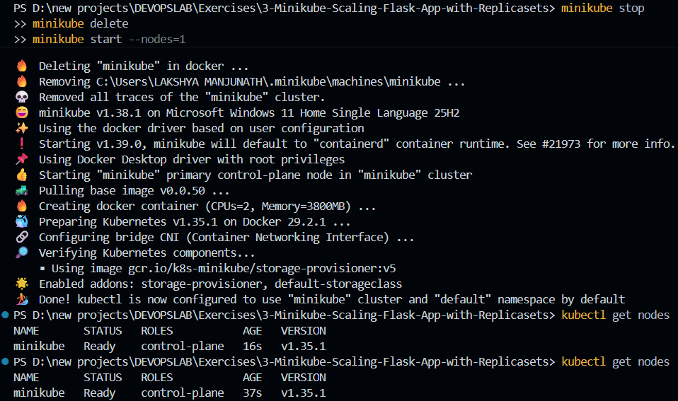
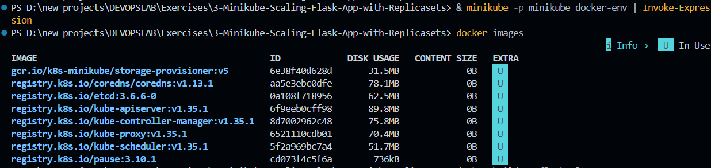
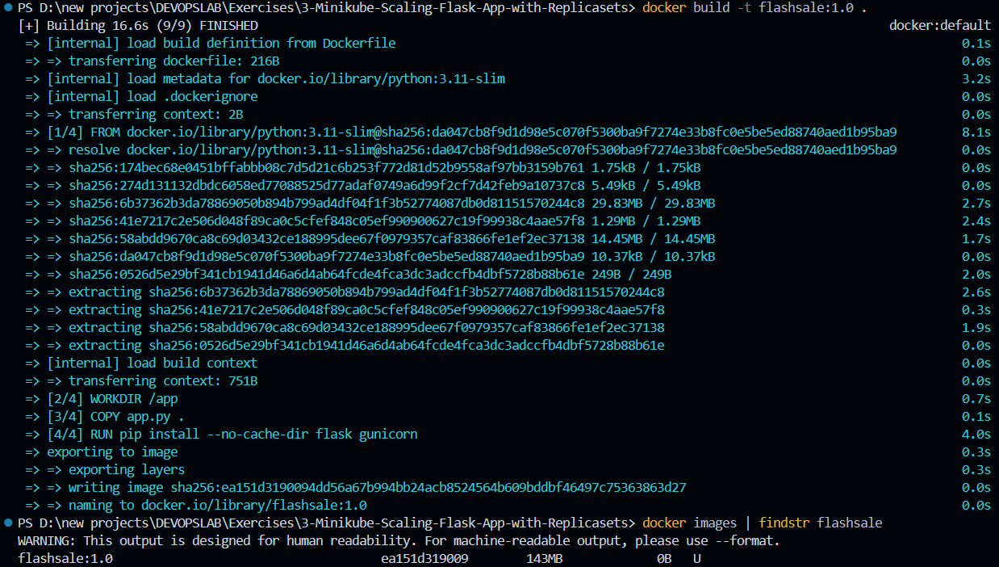
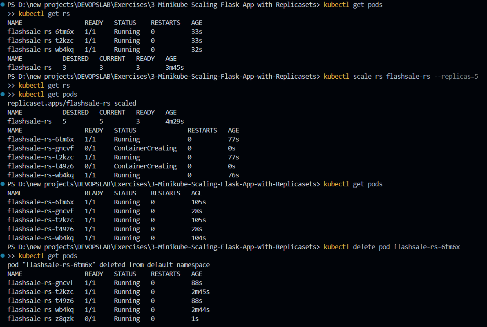
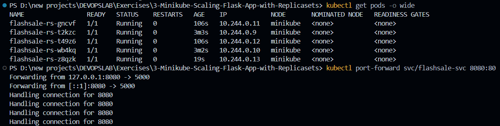
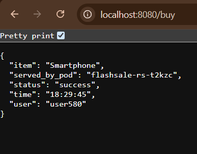
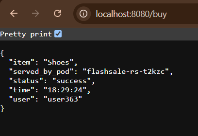

# Exercise 3 – Scaling Flask App on Single Node using ReplicaSets

## Objective

Deploy a Flask application as a Kubernetes ReplicaSet on Minikube, scale it up and down, observe self-healing when a Pod is deleted, and access the application through port-forwarding to verify load distribution across Pods.

## Environment

* OS: Windows 11
* Kubernetes: v1.35.1
* Minikube: v1.38.1
* Container Runtime: Docker
* Application: Flask (Python) — Flash Sale simulation app

## Real-Life Use Case: E-commerce Flash Sale

During a flash sale on an e-commerce site (like Flipkart's Big Billion Days or Amazon Prime Day), a simple Flask service that normally handles 100 requests per minute can suddenly face traffic spikes of 10,000 requests per minute. If the app runs on a single Pod, it will crash under the load. Using a ReplicaSet, Kubernetes can scale the app out to multiple Pods running the same image, distributing requests among them. Once the sale ends, the ReplicaSet can be scaled back down to save resources — the same pattern used by Netflix, YouTube, and Swiggy to handle peak traffic hours.

## 1. Minikube Setup

Reset and start a single-node Minikube cluster:

```bash
minikube stop
minikube delete
minikube start --nodes=1
kubectl get nodes
```

Minikube was deleted and restarted successfully, initializing Kubernetes v1.35.1. The node list confirmed a single control-plane node was ready:

```text
NAME       STATUS   ROLES           AGE   VERSION
minikube   Ready    control-plane   1m    v1.35.1
```



## 2. Point Docker at Minikube's Docker Daemon

Since Windows PowerShell doesn't support the bash `eval $(minikube docker-env)` syntax, the equivalent PowerShell command was used to build the image directly inside Minikube's internal Docker daemon, rather than the host machine's Docker:

```powershell
& minikube -p minikube docker-env | Invoke-Expression
docker images
```

This switched the current terminal session's Docker context to Minikube's daemon, confirmed by the presence of Minikube's internal system images:

```text
gcr.io/k8s-minikube/storage-provisioner:v5   6e38f40d628d   31.5MB
registry.k8s.io/coredns/coredns:v1.13.1      aa5e3ebc0dfe   78.1MB
registry.k8s.io/kube-apiserver:v1.35.1       6f9eeb0cff98   98.8MB
...
```



## 3. Build the Flask App Image

With the Docker context pointed at Minikube, the Flask app image was built locally so the cluster could access it without needing a registry push:

```powershell
docker build -t flashsale:1.0 .
docker images | findstr flashsale
```

The build completed successfully and the image was confirmed present in Minikube's Docker daemon:

```text
flashsale:1.0   ea151d319009   143MB
```



## 4. Create and Apply the ReplicaSet

A ReplicaSet manifest (`flashsale-replicaset.yaml`) was created, defining 3 replicas of the Flask app along with a ClusterIP Service to route traffic to the Pods. The image was referenced with `imagePullPolicy: Never` so Kubernetes would use the local image built in Step 3 instead of attempting to pull from a registry.

```yaml
apiVersion: apps/v1
kind: ReplicaSet
metadata:
  name: flashsale-rs
  labels:
    app: flashsale
spec:
  replicas: 3
  selector:
    matchLabels:
      app: flashsale
  template:
    metadata:
      labels:
        app: flashsale
    spec:
      containers:
      - name: flashsale-container
        image: flashsale:1.0
        imagePullPolicy: Never
        ports:
        - containerPort: 5000
        readinessProbe:
          httpGet:
            path: /health
            port: 5000
          initialDelaySeconds: 2
          periodSeconds: 5
        livenessProbe:
          httpGet:
            path: /health
            port: 5000
          initialDelaySeconds: 10
          periodSeconds: 10
        resources:
          requests:
            cpu: "100m"
            memory: "128Mi"
          limits:
            cpu: "500m"
            memory: "256Mi"
---
apiVersion: v1
kind: Service
metadata:
  name: flashsale-svc
spec:
  selector:
    app: flashsale
  ports:
  - name: http
    port: 80
    targetPort: 5000
  type: ClusterIP
```

```powershell
kubectl apply -f flashsale-replicaset.yaml
```

```text
replicaset.apps/flashsale-rs created
service/flashsale-svc created
```

## 5. ReplicaSet Scaling and Pod Self-Healing

The ReplicaSet was scaled from its initial 3 replicas up to 5, and one running Pod was manually deleted to observe Kubernetes' self-healing behavior:

```powershell
kubectl get rs
kubectl get pods
kubectl scale rs flashsale-rs --replicas=5
kubectl get rs
kubectl get pods
kubectl delete pod flashsale-rs-6tm6x
kubectl get pods
```

The ReplicaSet scaled successfully from 3 to 5 replicas, and all Pods reached the `Running` state:

```text
flashsale-rs-gncvf   Running
flashsale-rs-t2kzc   Running
flashsale-rs-t49z6   Running
flashsale-rs-wb4kq   Running
flashsale-rs-z8qzk   Running
```

After deleting `flashsale-rs-6tm6x`, Kubernetes automatically created a replacement Pod to maintain the desired replica count of 5 — demonstrating the ReplicaSet controller's continuous reconciliation between desired and actual state.



## 6. Pod Distribution and Port Forwarding

Pod placement was inspected, and the Service was port-forwarded to allow browser/CLI access from the host machine:

```powershell
kubectl get pods -o wide
kubectl port-forward svc/flashsale-svc 8080:80
```

All 5 Pods were confirmed `Running`, each with a unique internal cluster IP in the range `10.244.0.9`–`10.244.0.13`, and — since only a single node was used — all scheduled onto the same `minikube` node. The port-forward opened a tunnel from the local machine to the ClusterIP Service:

```text
Forwarding from 127.0.0.1:8080 -> 80
Handling connection for 8080
```



## 7. Accessing the /buy Endpoint

With the port-forward active, repeated requests were made to the `/buy` endpoint to confirm that traffic was being load-balanced across different Pods by the Service.

```powershell
Invoke-RestMethod http://localhost:8080/buy
```

**Request 1 — served by `flashsale-rs-t2kzc`:**

```json
{
  "item": "Shoes",
  "served_by_pod": "flashsale-rs-t2kzc",
  "status": "success",
  "time": "18:29:24",
  "user": "user363"
}
```



**Request 2 — served by `flashsale-rs-t2kzc`:**

```json
{
  "item": "Smartphone",
  "served_by_pod": "flashsale-rs-t2kzc",
  "status": "success",
  "time": "18:29:45",
  "user": "user580"
}
```



Each response returns a randomly selected item and the hostname of the Pod that served the request, confirming the Service is routing traffic across the ReplicaSet's Pods.

## 8. Kubernetes Working

The basic flow for scaling and self-healing a ReplicaSet is:

```text
kubectl
   ↓
Kubernetes API Server
   ↓
etcd
   ↓
ReplicaSet Controller
   ↓
Scheduler
   ↓
Worker Node
   ↓
Kubelet
   ↓
Container Runtime
   ↓
Flask Container (x N replicas)
```

* `kubectl` sends the ReplicaSet creation/scaling request to the Kubernetes API Server.
* The desired state (replica count) is persisted in `etcd`.
* The ReplicaSet Controller continuously compares the desired replica count to the actual number of running Pods.
* The Scheduler assigns each new Pod to a node.
* The Kubelet on that node ensures the Pod's container is running and healthy, using the readiness and liveness probes defined on `/health`.
* The container runtime starts the Flask container from the locally built `flashsale:1.0` image.
* The ClusterIP Service load-balances incoming requests across all healthy Pods matching the `app: flashsale` label.

## 9. Commands Used

```powershell
minikube stop
minikube delete
minikube start --nodes=1
kubectl get nodes

& minikube -p minikube docker-env | Invoke-Expression
docker images

docker build -t flashsale:1.0 .
docker images | findstr flashsale

kubectl apply -f flashsale-replicaset.yaml

kubectl get rs
kubectl get pods
kubectl scale rs flashsale-rs --replicas=5
kubectl delete pod flashsale-rs-6tm6x

kubectl get pods -o wide
kubectl port-forward svc/flashsale-svc 8080:80

Invoke-RestMethod http://localhost:8080/buy
```

## 10. Result

The Flask flash-sale application was successfully deployed as a Kubernetes ReplicaSet on Minikube with an initial replica count of 3. The ReplicaSet was scaled up to 5 Pods on demand, and Kubernetes automatically replaced a manually deleted Pod to restore the desired state — confirming the ReplicaSet's self-healing and reconciliation behavior. The application was accessed via port-forwarding to the ClusterIP Service, and repeated calls to the `/buy` endpoint confirmed that traffic was being served across the Pod replicas, each identified by its unique Pod hostname.