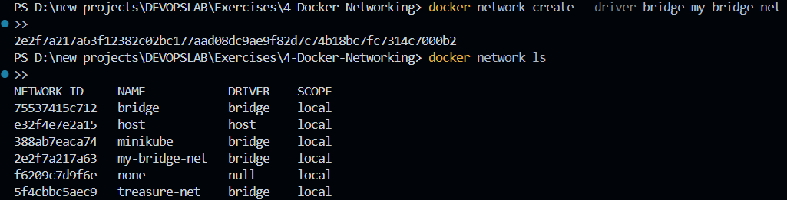
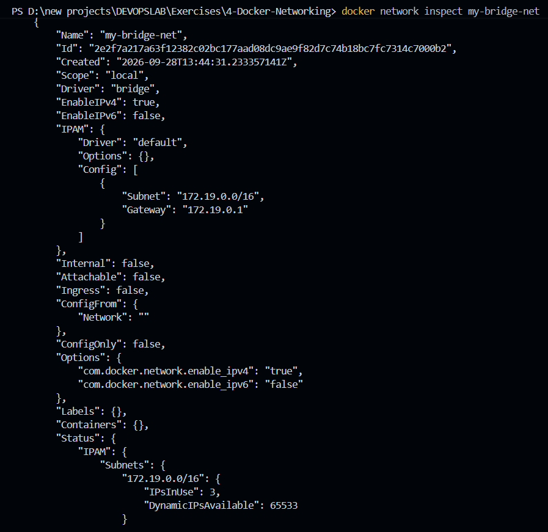
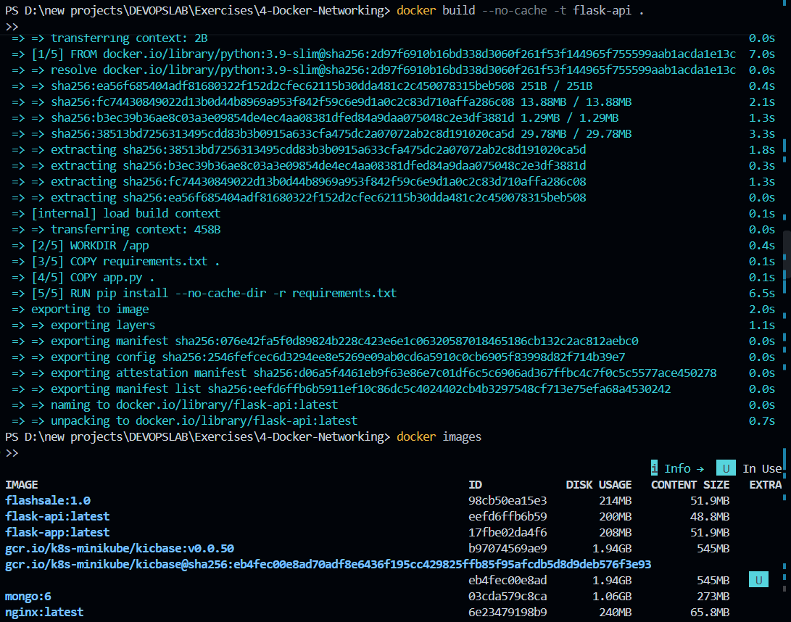
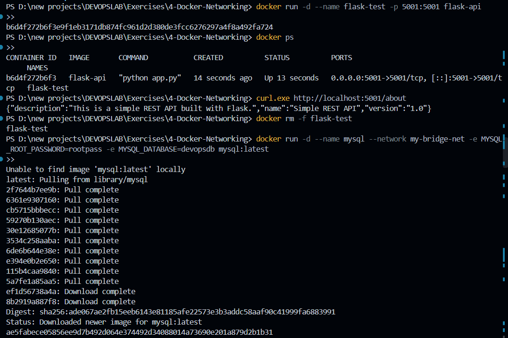
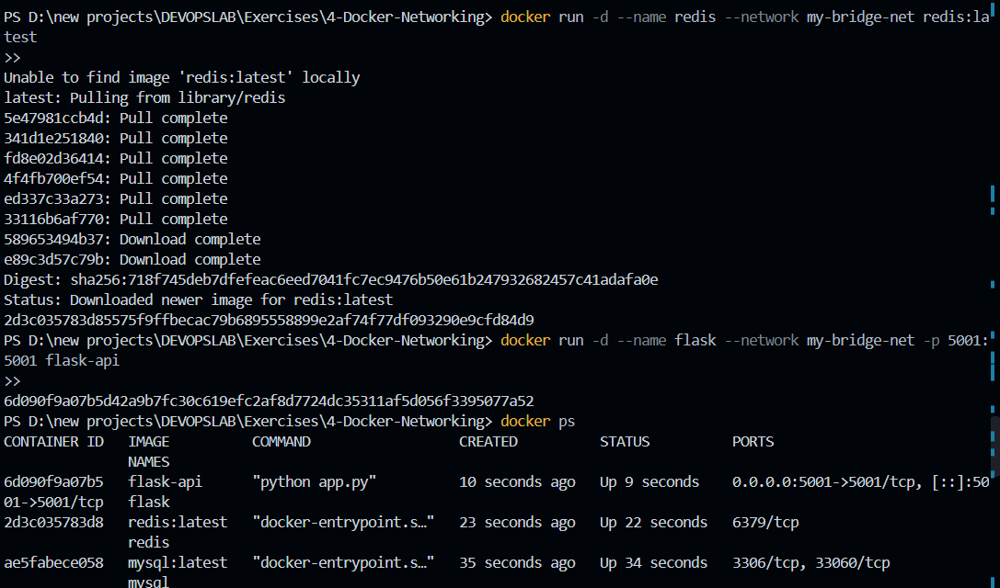
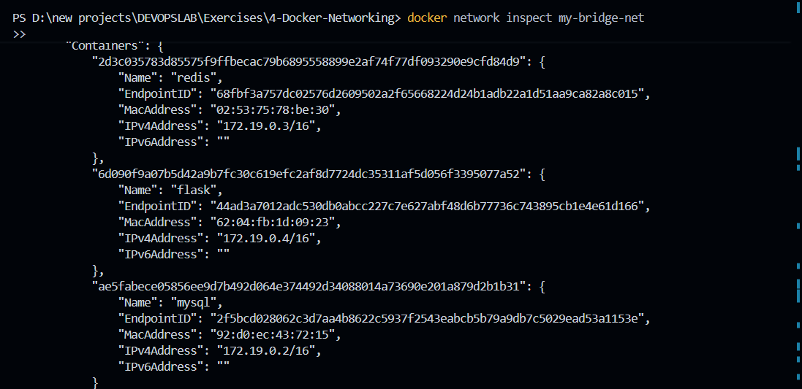
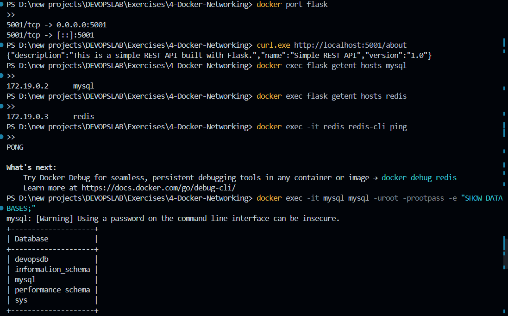
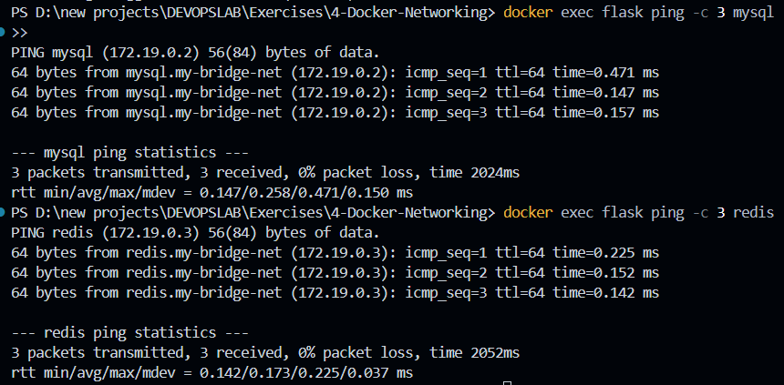

# Exercise 4 – Docker Networking

## Objective

Build a three-container application (Flask API, MySQL and Redis) on a user-defined Docker bridge network, understand host-to-container port publishing, and demonstrate container-to-container communication using Docker's built-in DNS and service discovery.

## Environment

* OS: Windows 11
* Container Runtime: Docker Desktop
* Shell: PowerShell (VS Code terminal)
* Application: Flask REST API
* Database: MySQL (`mysql:latest`)
* Cache: Redis (`redis:latest`)
* Network: `my-bridge-net` (user-defined bridge)

## Architecture

```text
                    Your Computer
                         │
                   localhost:5001
                         │
                         ▼
                ┌─────────────────┐
                │ Flask Container │
                │      flask      │
                │    port 5001    │
                └────────┬────────┘
                         │
                   my-bridge-net
                         │
            ┌────────────┴────────────┐
            │                         │
            ▼                         ▼
   ┌─────────────────┐       ┌─────────────────┐
   │ MySQL Container │       │ Redis Container │
   │      mysql      │       │      redis      │
   └─────────────────┘       └─────────────────┘
```

* The custom bridge network is the communication boundary between the containers.
* Docker's embedded DNS lets containers on the same user-defined network reach each other by name.
* Published ports (`-p`) control access from the host machine only.

## 1. Create the Docker Network

Create a user-defined bridge network and list all networks:

```powershell
docker network create --driver bridge my-bridge-net
docker network ls
```

The network was created successfully and appears in the list alongside `bridge`, `host`, `none` and the other existing networks:



## 2. Inspect the Network

Inspect the new network to view its configuration:

```powershell
docker network inspect my-bridge-net
```

Key details from the output:

* Driver: `bridge`
* Subnet: `172.19.0.0/16`
* Gateway: `172.19.0.1`
* IPv4 enabled, IPv6 disabled

Docker may choose a different subnet depending on the networks already present on the machine, so exact IP ranges should never be hard-coded.



## 3. Create the Flask Application

Three files are needed in the exercise folder.

**`app.py`**

```python
from flask import Flask, jsonify

app = Flask(__name__)

@app.route('/about', methods=['GET'])
def about():
    return jsonify({
        "name": "Simple REST API",
        "version": "1.0",
        "description": "This is a simple REST API built with Flask."
    })

if __name__ == '__main__':
    app.run(host='0.0.0.0', port=5001)
```

`host='0.0.0.0'` makes Flask listen on all interfaces inside the container instead of only on `127.0.0.1`. Without it, the published port would not be reachable from the host.

**`requirements.txt`**

```text
Flask==2.0.1
Werkzeug==2.0.3
```

Werkzeug is pinned to `2.0.3` because Flask 2.0.1 fails with newer Werkzeug releases due to API incompatibility.

**`Dockerfile`**

```dockerfile
FROM python:3.9-slim

WORKDIR /app

COPY requirements.txt .
COPY app.py .

RUN pip install --no-cache-dir -r requirements.txt

EXPOSE 5001

CMD ["python", "app.py"]
```

Final folder structure:

```text
4-Docker-Networking/
├── Dockerfile
├── app.py
├── requirements.txt
└── screenshots/
```

## 4. Build the Flask Image

Build the image and confirm it exists:

```powershell
docker build --no-cache -t flask-api .
docker images
```

The build completed successfully and `flask-api:latest` appears in the image list:



## 5. Test Flask Independently and Start MySQL

First, run Flask on its own to confirm the image works before networking is involved:

```powershell
docker run -d --name flask-test -p 5001:5001 flask-api
docker ps
curl.exe http://localhost:5001/about
```

The API responded with the expected JSON:

```json
{"description":"This is a simple REST API built with Flask.","name":"Simple REST API","version":"1.0"}
```

The test container was then removed to free port `5001` and the name for the real deployment, and MySQL was started on the custom network with an explicit root password and database:

```powershell
docker rm -f flask-test

docker run -d --name mysql --network my-bridge-net -e MYSQL_ROOT_PASSWORD=rootpass -e MYSQL_DATABASE=devopsdb mysql:latest
```

The MySQL image was pulled and the container started with the `devopsdb` database:



## 6. Start Redis and Flask on the Network

Start Redis and the final Flask container on `my-bridge-net`:

```powershell
docker run -d --name redis --network my-bridge-net redis:latest

docker run -d --name flask --network my-bridge-net -p 5001:5001 flask-api

docker ps
```

`docker ps` shows all three containers running: `flask`, `mysql` and `redis`. Only Flask publishes a port (`5001`); MySQL and Redis are reachable only inside the network.



## 7. Verify Containers on the Network

Inspect the network again to confirm all containers are attached:

```powershell
docker network inspect my-bridge-net
```

Under `Containers`, all three services are connected to `my-bridge-net`:

| Container | IP Address |
|-----------|------------|
| mysql | 172.19.0.2 |
| redis | 172.19.0.3 |
| flask | 172.19.0.4 |

These IPs may change if the containers are recreated, which is why name-based communication is preferred.



## 8. Verify Port Publishing, DNS and Services

Run the full set of checks:

```powershell
docker port flask
curl.exe http://localhost:5001/about
docker exec flask getent hosts mysql
docker exec flask getent hosts redis
docker exec -it redis redis-cli ping
docker exec -it mysql mysql -uroot -prootpass -e "SHOW DATABASES;"
```

Results:

* `docker port flask` shows port `5001` mapped to `0.0.0.0:5001`.
* The REST API responds with the same JSON through the published port.
* Docker DNS resolves `mysql` to `172.19.0.2` and `redis` to `172.19.0.3` from inside the Flask container.
* Redis replies `PONG`.
* MySQL lists `devopsdb`, `information_schema`, `mysql`, `performance_schema` and `sys`.



## 9. Connectivity Test (Ping)

Install `ping` inside the Flask container (the slim Python image does not include it), then test connectivity by container name:

```powershell
docker exec flask bash -c "apt-get update && apt-get install -y iputils-ping"
docker exec flask ping -c 3 mysql
docker exec flask ping -c 3 redis
```

Results:

* Ping to `mysql`: 3 packets received, 0% packet loss, average about 0.25 ms
* Ping to `redis`: 3 packets received, 0% packet loss, average about 0.17 ms

This confirms the Flask container can reach both services by name, with no hard-coded IP addresses.



## 10. Docker Networking Working

Two different paths are used in this exercise:

```text
Host  ──►  localhost:5001  ──►  Flask        (published port)

Flask ──►  mysql  (DNS name)  ──►  MySQL     (internal network)
Flask ──►  redis  (DNS name)  ──►  Redis     (internal network)
```

* A published port (`-p HOST_PORT:CONTAINER_PORT`) is an external entry point from the host into a container.
* Containers on the same user-defined bridge network communicate directly using container names, resolved by Docker's embedded DNS.
* Ports `3306` (MySQL) and `6379` (Redis) do not need to be published for Flask to reach them internally.
* Default bridge networking does not provide name-based DNS between containers; a user-defined bridge does.
* Bridge networking gives each container its own network namespace, whereas host networking shares the host's network stack.

## 11. Commands Used

```powershell
docker network create --driver bridge my-bridge-net
docker network ls
docker network inspect my-bridge-net

docker build --no-cache -t flask-api .
docker images

docker run -d --name flask-test -p 5001:5001 flask-api
docker ps
curl.exe http://localhost:5001/about
docker rm -f flask-test

docker run -d --name mysql --network my-bridge-net -e MYSQL_ROOT_PASSWORD=rootpass -e MYSQL_DATABASE=devopsdb mysql:latest
docker run -d --name redis --network my-bridge-net redis:latest
docker run -d --name flask --network my-bridge-net -p 5001:5001 flask-api
docker ps

docker port flask
docker exec flask getent hosts mysql
docker exec flask getent hosts redis
docker exec -it redis redis-cli ping
docker exec -it mysql mysql -uroot -prootpass -e "SHOW DATABASES;"

docker exec flask ping -c 3 mysql
docker exec flask ping -c 3 redis
```

## 12. Cleanup

```powershell
docker stop mysql redis flask
docker rm mysql redis flask
docker network rm my-bridge-net
docker rmi flask-api
```

## 13. Result

A Flask API, MySQL database and Redis cache were deployed as three containers on a custom Docker bridge network.

The Flask API was accessible from the host through the published port `5001`, while Flask reached MySQL and Redis internally by container name using Docker's DNS. DNS lookups and ping tests confirmed successful service discovery with no hard-coded IP addresses.